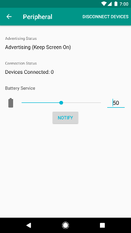
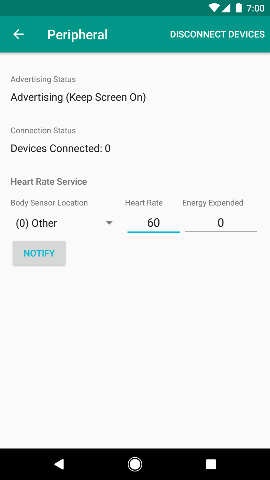

# BLE Peripheral Simulator

The BLE Peripheral Simulator is an Android app that allows developers to try
out new features of Web Bluetooth without the need for a BLE Peripheral Device.

You can build it from source or install it from the [Google Play Store](https://play.google.com/store/apps/details?id=io.github.webbluetoothcg.bletestperipheral).

A developer can use the app to simulate a BLE Peripheral with one of two services:

* Battery Service
* Heart Rate Service

The developer can use the new Web Bluetooth features to connect to the app to Read and Write Characteristics, and Subscribe to Notifications for when the Characteristics change.

From the app a developer can set the characteristics' values and send notifications.

 
